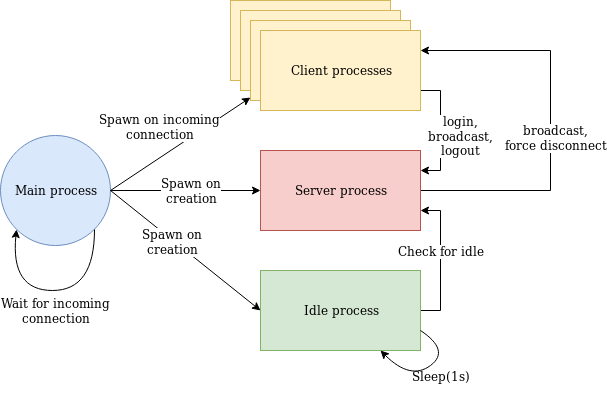
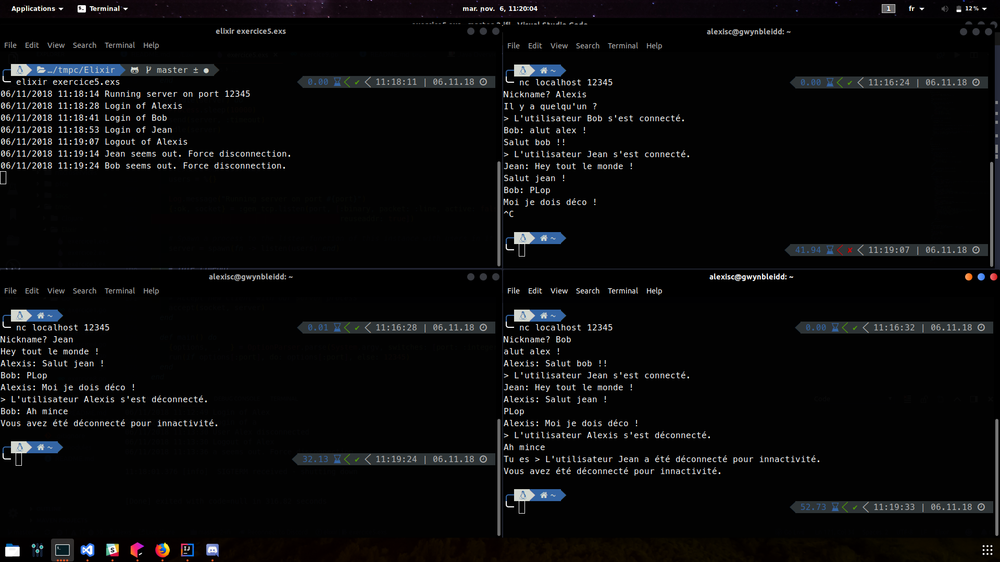

# TMPC Elixir : TP3 Server Chat

## Useful links

* [Sujet du TP ici](http://users.polytech.unice.fr/~eg/TMPC/Tds/Td3/sujet.html)

## Architecture

There is four main processes :

1. Main process
2. Server process
3. Idle checker process
4. Client process

### Main process

It first create one server process, one idle process and then wait for incoming connection and create a Client process for each ones.

### Server process

The server process is waiting for incoming messages and contains the data model (every user connected with their properties).
We are able to `register` a new user on connection, a user is unique and identified by its username, if it already exist the server responds that the username is already taken, if not the user is added to the existing users and can now communicate with the other users.

We can also `broadcast` a message to the users, `broadcast` a message to the users except the emitter.

We can `disconnect` a specific user, this can be asked by the user (*CTRL + C* handling).

And finally ask to update the idle times, it iterates through the users, filter the ones that are now considered idle and disconnect them properly (closing socket and then exiting the process in charge of the client).

### Idle process checker

This is just a process that ask to update the timeout every seconds.

### Client process

The client process handles a unique socket relative to the user, it also has a reference to the *server process* so it can broadcast a message from the user, handle the disconnection and the timeouts.

## Communication

## Screenshot

